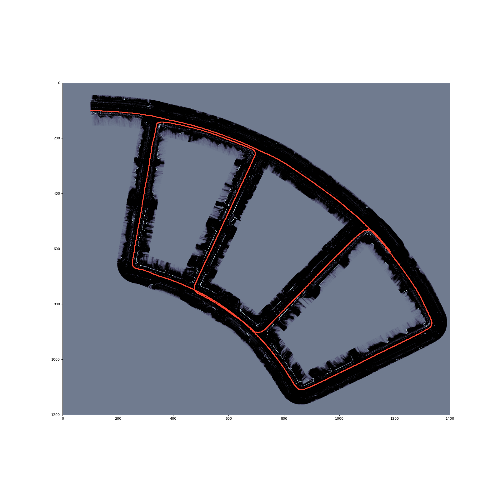
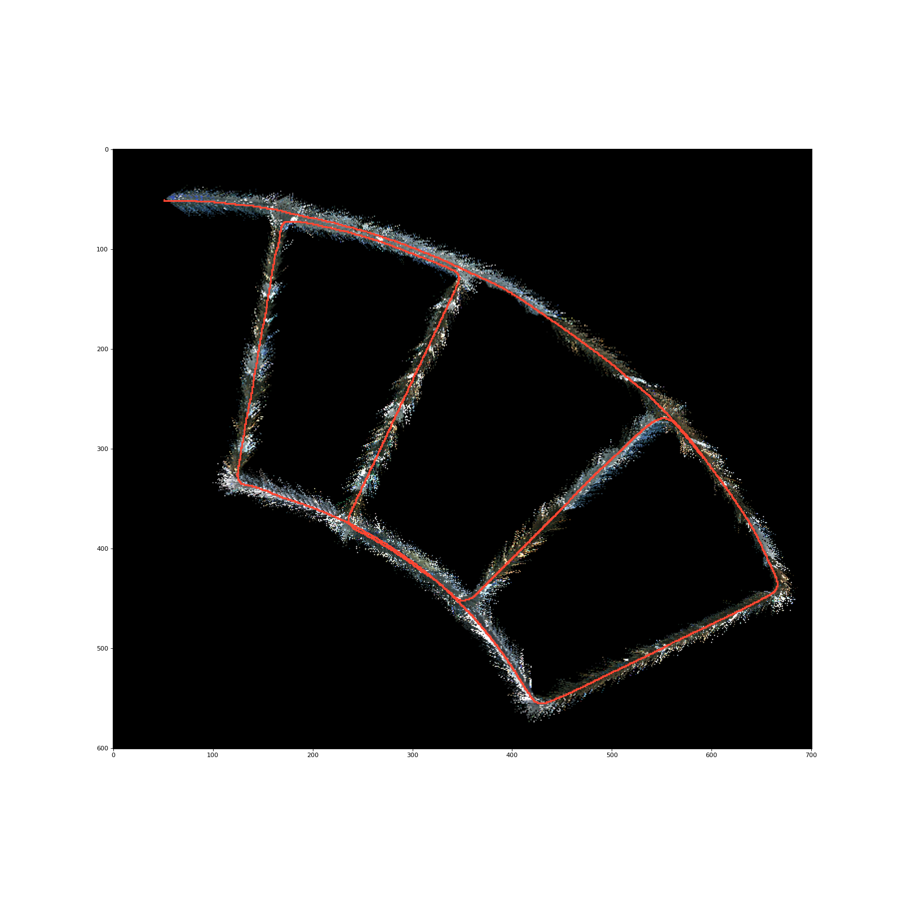
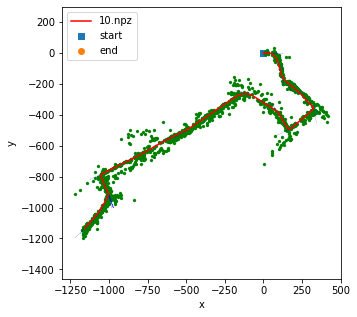

# Robotics-Sensing-Estimation
UCSD 22 Winter ECE276A Projects. There are mainly 3 projects as follow

- Color Segmentation & Bin Detection by Logistic Regression / Gaussian Discriminant Analysis
  
- Lidar Point Cloud SLAM & Texture Mapping by Particle Filtering
  
- Visual Inertial Odometry (VIO) by Extended Kalman Filter/

  